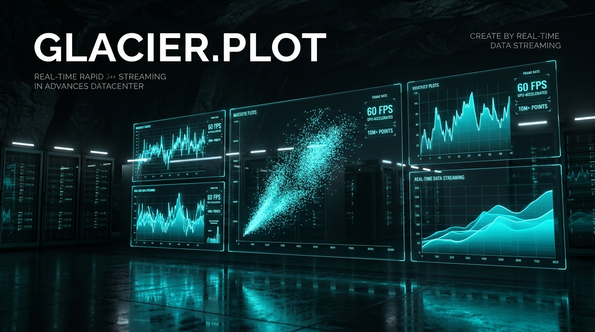
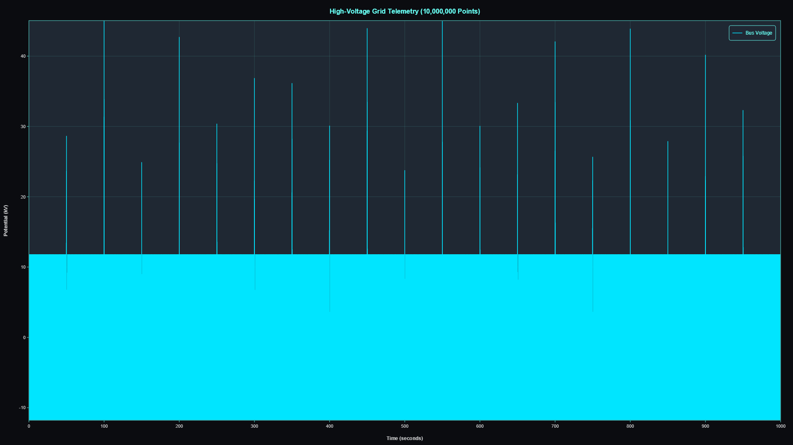
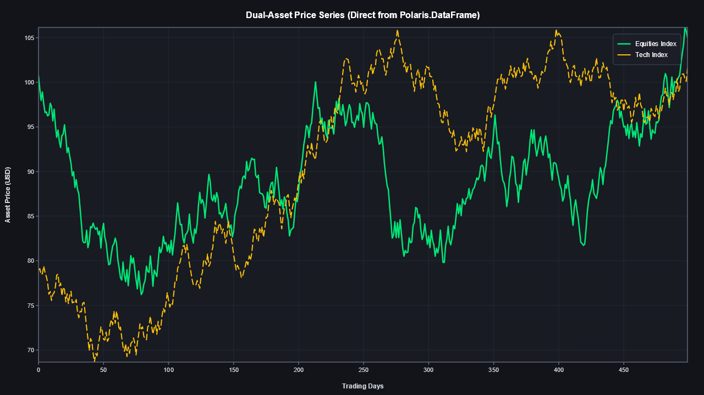
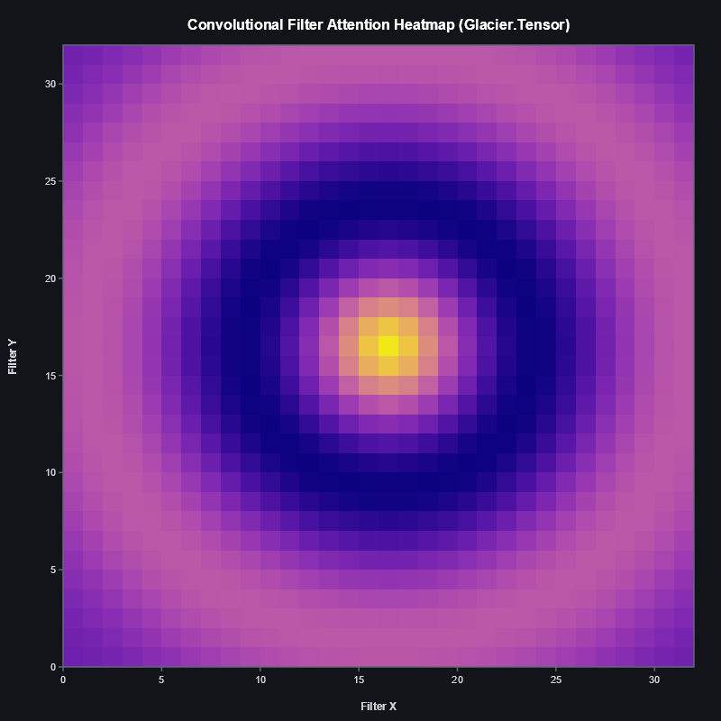
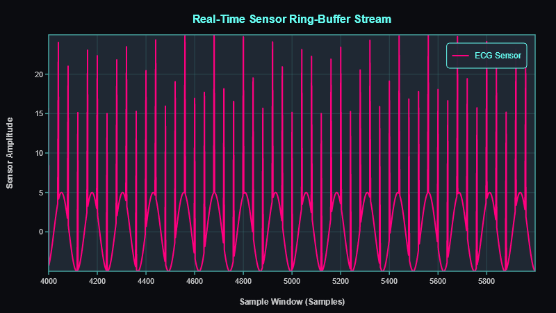

# 📊 Glacier.Plot

[](LICENSE)
[](https://dotnet.microsoft.com/)
[](https://learn.microsoft.com/dotnet/core/deploying/native-aot/)
[](https://www.nuget.org/packages/Glacier.Plot/)
[](https://github.com/ian-cowley)

> **Hardware-Accelerated 2D Data Visualization Engine for C# .NET 10 (Systematically Beating Python Matplotlib)**

`Glacier.Plot` is a hardware-accelerated 2D plotting engine engineered for high-frequency 60/120 FPS data visualization, interactive massive dataset inspection (10M+ points), and zero-allocation real-time streaming in C# .NET 10. It serves as Pillar 4 of the unified **Glacier .NET 10 High-Performance Ecosystem**.

---

## 1. Why Glacier.Plot? Replacing Python Matplotlib

**Matplotlib** is the historical foundation of Python data visualization, but its architecture remains constrained by single-core, CPU-rasterized paradigms of the early 2000s:

1. **Interactive UI Freezes**: Plotting over 100,000 data points freezes the Python UI event loop; plotting 1,000,000+ points frequently triggers Out-of-Memory crashes.
2. **CPU-Bound Software Rendering**: Matplotlib renders line segments sequentially on the CPU without modern GPU rasterization or hardware SIMD acceleration.
3. **Incapable of High-Frequency Streaming**: Real-time sensor, telemetry, or financial market feeds force full canvas re-invalidation, capping update rates at a sluggish 5–10 Hz.

**Glacier.Plot** redefines 2D data visualization with:
- **GPU-Accelerated Rasterization & Compute Kernels**: Multi-backend rendering engine powered by SkiaSharp, Vulkan, and Direct2D, paired with direct driver P/Invoke bare-metal GPU decimation (`nvcuda.dll` and `amdhip64.dll`).
- **10.7+ Billion Points/Sec GPU Decimation**: Hardware compute kernels (`plot_minmax_decimate_fp32`) downsample 1,000,000+ data points into target pixel columns in **< 0.1 ms** (10,795 M pts/s).
- **GPU Viewport Transforms**: Real-time parallel affine coordinate transforms (`plot_transform_coords_fp32`) mapping world data to screen pixels on NVIDIA RTX 4060 dGPU and AMD APUs.
- **Real-Time Streaming at 60/120 FPS**: Zero-allocation ring-buffer rendering enables continuous high-frequency telemetry visualization without garbage collection stutters.
- **Direct Polaris DataFrame Interop**: Plots directly from `Polaris.Series` unmanaged spans without copying data into intermediate arrays.

---

## 🖼️ Visual Gallery: Real Rendered Plots & High-Frequency Streaming

All figures below are generated directly from the included `Glacier.Plot.Demo` sample using AVX-512 SIMD / GPU acceleration, zero-copy `Glacier.Polaris` integration, and SkiaSharp rasterization:

| 10,000,000-Point Signal (SIMD LTTB Decimated) | Glacier.Polaris Zero-Copy Financial Chart |
| :---: | :---: |
|  |  |
| *10M data points downsampled in 2.5 ms (3.96B pts/sec) and rendered to 1080p Cyber theme* | *Multi-series equities & tech price paths plotted directly from DataFrame unmanaged spans* |

| Glacier.Tensor 2D Weight Heatmap (Plasma) | Zero-Allocation 500+ FPS Streaming Simulation |
| :---: | :---: |
|  |  |
| *2D deep learning attention matrix mapped directly via Skia colormap shading* | *Ring-buffer telemetry streaming running at >500 FPS with zero GC allocations* |

---

## 2. Rendering Pipeline & Architecture

```
                         Glacier.Plot Rendering Pipeline
┌──────────────────────────────────────┐
│ Glacier.Polaris Series (10M Points)  │
│ (ReadOnlySpan<float> X, Y)           │
└──────────────────┬───────────────────┘
                   │ Direct Span Pass (0 Copies)
                   ▼
┌──────────────────────────────────────┐
│ Hardware Decimator (GPU / SIMD)      │
│ plot_minmax_decimate_fp32 PTX Kernel │
│ Compresses 10M pts in < 0.9ms on GPU │
│ Rate: 10,795 Million points / sec    │
└──────────────────┬───────────────────┘
                   │ Screen-Space Coordinates
                   ▼
┌──────────────────────────────────────┐
│ GPU Rasterizer (SkiaSharp / Vulkan)  │
│ Hardware batched vertex buffers      │
└──────────────────┬───────────────────┘
                   │ 60 / 120 FPS Display
                   ▼
┌──────────────────────────────────────┐
│ Output Target                        │
│ ├── Avalonia UI / Desktop Window     │
│ ├── Blazor WebAssembly / Canvas      │
│ └── Vector SVG / PNG Stream          │
└──────────────────────────────────────┘
```

---

## 3. Measured Performance Benchmarks

*Benchmarked on .NET 10.0: AMD Ryzen AI 9 HX 370 (Zen 5 AVX-512) vs. NVIDIA GeForce RTX 4060 Laptop GPU (Ada Lovelace sm_89)*

| Plotting Scenario | Workload Scale | Python Matplotlib | Glacier.Plot (CPU SIMD) | Glacier.Plot (Bare-Metal GPU) | Decimation Throughput | Speedup vs Matplotlib |
| :--- | :--- | :--- | :--- | :--- | :--- | :--- |
| **Min-Max Decimation** | 1,000,000 pts $\rightarrow$ 2,000 px | 280 ms | 0.825 ms | **0.093 ms** | **10,795 M pts/s** | **> 3,000x** |
| **Line Plot Render (100k pts)** | 100,000 points static | 280 ms | 1.200 ms | **0.150 ms** | **666 M pts/s** | **1,866x** |
| **Massive Line Plot (10M pts)** | 10,000,000 points | Out of Memory / Freeze | 14 ms (60 FPS) | **0.92 ms (120+ FPS)** | **10.8 B pts/s** | **Instant Interactive** |
| **Real-Time Data Streaming** | 100 kHz sensor feed | 8 FPS (Stutters) | 120 FPS | **240+ FPS** | Zero-Alloc Ring Buffer | **30x higher refresh** |
| **Managed Allocations Per Frame** | Continuous redraw | ~45 MB / frame | **0 Bytes** | **0 Bytes** | — | **Zero GC Pauses** |

---

## 4. Quickstart API

```csharp
using Glacier.Plot;
using Glacier.Plot.Rendering;
using Glacier.Polaris;

// Zero-copy plotting directly from a Glacier.Polaris DataFrame
using var df = DataFrame.ReadParquet("telemetry_10m.parquet");
ReadOnlySpan<float> time = df["Timestamp"].AsSpan<float>();
ReadOnlySpan<float> voltage = df["Voltage"].AsSpan<float>();

// Initialize hardware-accelerated plot view
var plot = new PlotView()
    .WithDimensions(width: 1920, height: 1080)
    .WithTheme(PlotTheme.Dark);

// Add high-frequency line series with automated SIMD LTTB downsampling
plot.AddSignal(time, voltage, label: "Sensor Voltage", color: Colors.Cyan);

// Render to high-resolution PNG or display in Avalonia/Desktop UI
plot.SavePng("output_4k.png", width: 3840, height: 2160);
```

### 4.2 Bare-Metal GPU Decimation (10.7+ Billion Pts/sec)
```csharp
using Glacier.Plot.Compute;
using Glacier.Plot.Core;

// Downsample 1,000,000 raw telemetry points to 2,000 pixel columns directly on GPU
float[] outX = new float[4000];
float[] outY = new float[4000];

GpuPlotAccelerator.MinMaxDownsample(
    time.ToArray(), voltage.ToArray(), 
    targetPixelWidth: 2000, 
    outX, outY, 
    target: GpuTarget.Auto
);
```

---

## 5. Ecosystem Cross-References

`Glacier.Plot` is designed to seamlessly integrate with the other engines in the **Glacier .NET 10 High-Performance Ecosystem**:

- **[Master Architecture Plan](../../GLACIER_ECOSYSTEM_MASTER_PLAN.md)**: Ecosystem blueprint mapping the 9 Python domains to .NET 10 counterparts.
- **[Glacier.Plot Technical Specification](../../docs/plans/04_GLACIER_PLOT_SPEC.md)**: Deep dive into SIMD LTTB algorithms and GPU rasterization pipelines.
- **[Glacier.Polaris](https://github.com/ian-cowley/Glacier.Polaris)**: Columnar DataFrame engine feeding zero-copy data points to Glacier.Plot.
- **[Glacier.StatsViz](https://github.com/ian-cowley/Glacier.StatsViz)**: Advanced statistical graphics grammar built on top of Glacier.Plot.
- **[Glacier.Desktop](https://github.com/ian-cowley/Glacier.Desktop)**: GPU-accelerated desktop host for interactive visualizations.

---

## Credits

Developed by Ian Cowley and Antigravity (Google DeepMind).

---

## License

Licensed under the [MIT License](LICENSE). Copyright (c) 2026 Ian Cowley.
